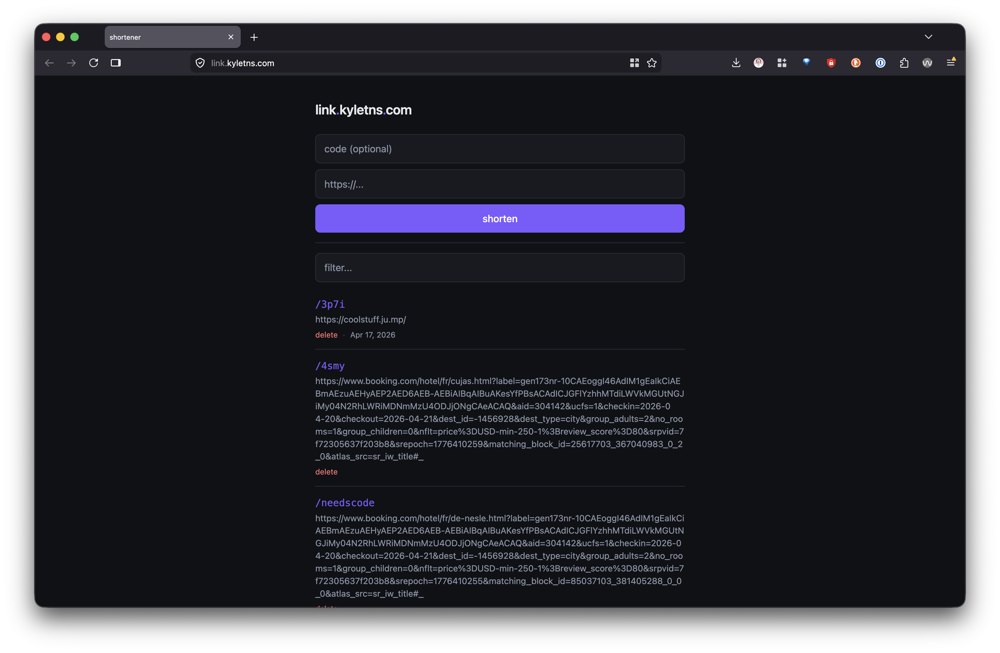

# My Little Shortener

A tiny personal URL shortener running on a Cloudflare Worker + KV.



## Why

I wanted short links under my own domain without paying for Bitly or running a server. A single Worker file + a KV namespace does the whole job for free, and I can manage links from any device — terminal, phone, browser.

## How it works

- **Worker** (`src/worker.js`) handles three things:
  - `GET /<code>` — looks up `code` in KV and 302s to the stored URL. Unknown codes redirect to my homepage.
  - `GET /admin` — serves a single-page dark-themed HTML admin UI (login, add, filter, delete).
  - `POST /api/create | /api/delete`, `GET /api/list` — JSON API protected by a bearer token (`ADMIN_PASSWORD`, stored as a Wrangler secret).
- **KV namespace** `LINKS` stores `code → url`, with a `created` timestamp in metadata.
- If `POST /api/create` is called without a `code`, the worker generates a 4-char slug from a collision-safe alphabet (and returns any existing code if the URL is already stored).
- Cloudflare handles DNS, TLS, and routing via a custom domain bound to the Worker.

## A note on KV consistency

Cloudflare KV's `list` operation is eventually consistent — cached at the edge for up to ~60s after writes. So right after creating or deleting a link, a fresh `list` from the same POP can return a stale view (sometimes showing the whole list as empty for a bit). The admin UI works around this by updating its in-memory list optimistically after create/delete instead of refetching, so you won't see the lag during normal use. A hard refresh within the cache window can still briefly show stale state.

## Using it

- **Browser:** visit `/admin`, unlock, paste a URL, hit shorten. Gets copied to clipboard.
- **Terminal:** `shorten <url>` or `shorten <code> <url>` (zsh function that curls `/api/create`).
- **TextExpander:** a shell-script snippet reads the clipboard, POSTs to the API, outputs the short URL.
- **iOS Shortcut:** Share URL → POSTs to the API → copies short URL clipboard.

## Deploy

```
npm install
npx wrangler login
npx wrangler kv namespace create LINKS   # paste id into wrangler.toml
echo "your-password" | npx wrangler secret put ADMIN_PASSWORD
npx wrangler deploy
```

Then in the Cloudflare dashboard, bind a custom domain to the Worker.

Local dev: `npx wrangler dev` (set `ADMIN_PASSWORD` in `.dev.vars`).

## Customizing

In `wrangler.toml`:

- **`name`** — the Worker name (also the default `*.workers.dev` subdomain). Change before first deploy.
- **`kv_namespaces[0].id`** — the KV namespace id. Replace with the id printed by `wrangler kv namespace create LINKS`.
- **`vars.TITLE`** — the heading shown on `/admin`. Defaults to `My Little Shortner` if unset. Dots in the title get accent-color styling (e.g. `link.example.com`).

**License:** Do whatever you want I obviously wrote this with Claude 🤖
